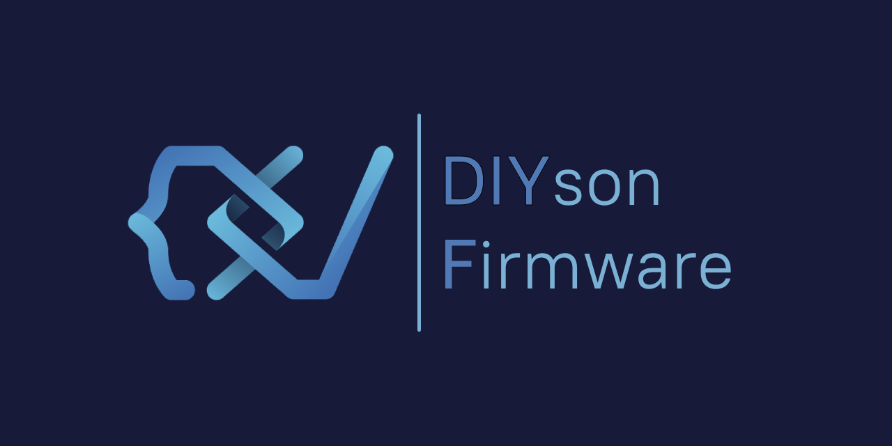
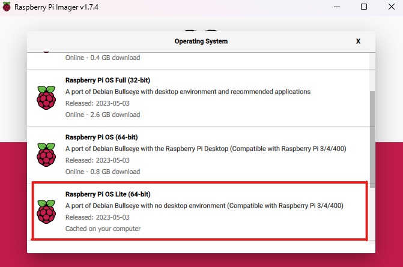
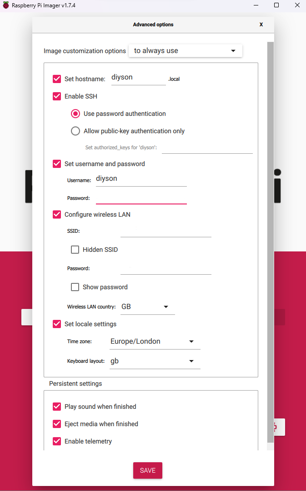
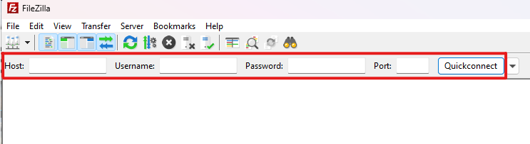
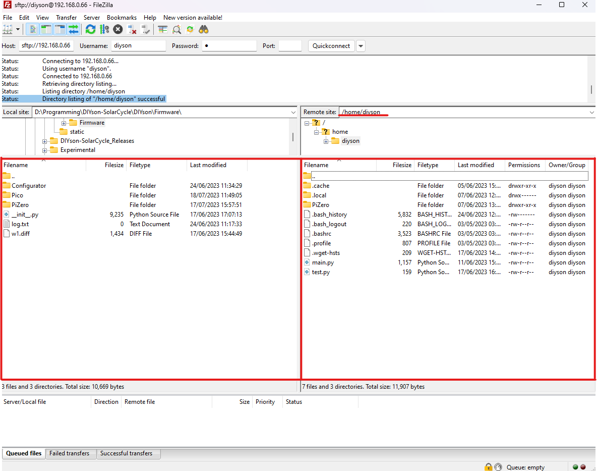
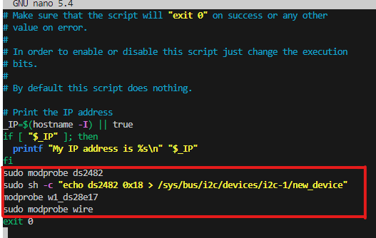

# Install Directions for v1.0.0-alpha3

Please follow instructions carefully, incorrect installation may damage hardware. a Windows or MacOS Computer is Required

## Required Hardware
Required Hardware can be found below and must be included for the device to function normally. Hardware has been chosen for its low cost, ease of use and avalibilty. links included will direct to UK Websites, use local websites where possible. 


* [ABElectronics 1 Wire Pi Zero HAT](https://thepihut.com/products/1-wire-pizero)
    * Or a DS2482 Equipped board with a 3.3v 1-Wire Bus
* [Raspberry Pi Zero W 2](https://rpilocator.com/?cat=PIZERO2)
    * They are slowly coming back into stock, but you can use a 4B instead
* [Raspberry Pi Pico](https://thepihut.com/products/raspberry-pi-pico)
    * Other Microcontrollers can work, but install directions may vary. It must have support for I2C and PWM
* [VL53L1X Time of Flight Sensor](https://thepihut.com/products/vl53l1x-time-of-flight-tof-sensor-breakout)
    * Use [this](https://thepihut.com/products/adafruit-vl53l1x-time-of-flight-distance-sensor-30-to-4000mm-stemma-qt-qwiic) board if using STEMMA QT
* [LTR-559 Ambient Light and Proximity Sensor](https://thepihut.com/products/ltr-559-light-proximity-sensor-breakout)
* [DS28E17 Equipped Board](https://www.aliexpress.com/item/1005004596201472.html?&_t=pvid:d63ff60f-48bc-4813-bf9a-309e718e48c8&afTraceInfo=1005004596201472__pc__pcBridgePPC__xxxxxx__1689607409&spm=a2g0o.ppclist.product.mainProduct)
    * This may prove challaging to obtain, but your mileage may vary
* A Three-lane DIYson SuperTrack
* A 16GB MicroSD Card and a reader

## Wiring

Please follow the steps carefully, yuo may easily damage your Hardware. Soldering Iron and a proficancy in electronics required.
These instructions use hobbiest level breakout boards. a Custom PCB will be used in later itterations.

Dallas 1-Wire Bus Protocol is used, data and power can be transfered over one data pin + GND. the DS28E17 and DS2482 chips act as a bridge from I2C to 1-Wire, and back to I2C again. This extends the range of I2C and removes the necessity of an extra data pin.

### Step 1

The DS28E17 runs off a 3.3v 1-Wire Bus, but the 1-Wire HAT runs off 5v. This requires a modifcation to the HAT. Follow the soldering directions [here](https://www.youtube.com/watch?v=VHqgbdoMUTA).

Desolder the *POWER* Solder Jumper and solder a jumper wire from GPIO Pin 1 to the Solder Jumper. make sure the pad closest to the GPIO Pins **is not** connected

Note: **Ignore the IButton Socket**, as it isn't included with the 1-Wire PI HAT Zero. **Do Not Solder the RJ Connectors.**

### Step 2

This Step will focus on the SuperTrack. Use Jumper wires if you do not have a *Three-lane* DIYson SuperTrack

* Solder a wire from the *OW* Pin on the 1-Wire PI HAT to the far Left track on the SuperTrack. 
* Solder a Wire from *GND* to the Middle track.
* Solder a wire from your Main Power Supply to the far right track.

On the other side of the SuperTrack:

* Solder the *OW* track to the *IO* pin on the DS28E17
* Solder the *GND* track to the *GND* pin on the DS28E17

### Step 3
This Step will focus on the Sensors *VL53L1X* and *LTR-559*

* Solder *3V3* pins together and connect it to the *3V3* pin (36) on the Pico.
* Solder *GND* pins together and connect it to the *GND* pin (38) on the Pico.
* Solder *SDA* pins together and connect it to *SDA* pin on the DS28E17.
* Solder *SCL* pins together and connect it to *SCL* pin on the DS28E17.

Interupts are not supported on Circuitpython, so pins *INT* will remain unconnected

### Step 4
This Step will focus on connecting the Pico to the main Circuit.

* Connect the 5v pin to the output of a 5v buck converter
* Connect the LED Power supply track to the *VCC* pin on the buck converter
* Solder *GND* pin on the DS28E17 to *GND* on the Pico
* Solder *3V3* pin on the DS28E17 to *3V3* on the Pico

## Software installation

Download the required software package (v1.0.0-alpha3) from github [here](https://github.com/Joseph0M/DIYson-SolarCycle/releases).

## Step 1 

* Download [FileZilla](https://filezilla-project.org/download.php) for remote FTP transfers 

* Download [Thonny](https://thonny.org/)

* Download [Raspberry Pi Imager](https://www.raspberrypi.com/software/)

* UnZIP the software package and dump the contents into your desktop.

## Step 2

* Open Thonny and click *Local Python 3* then *Configure Interpreter*
* Click *Circuitpython (generic)* in the dropdown menu
* Click *install or update Circuitpython*
* Follow the instructions that will appear. 
    * the Pico requires holding **BOOTSEL** While being plugged into your computer

## Step 3

* Click *Local Python 3* and select Circuitpython.
* Click *Veiw* then tick *Files*
* Dump the Pico Folder into the bottom section
* move the folder  *lib* in the Pico folder and replace this with the current lib folder in the main directory.

## Step 4

* Navigate to RPI Imager.
*  Choose OS > Raspberry Pi OS (Other) > Raspberry Pi OS Lite (64-bit)

* Navigate to Choose Storage and slect the SD Card
* Go to Settings (bottom right) 
    * Enable `SSH`
        * Select Password authentication
    * Enable `Set Username and Password`
        * Set Username to `diyson`
        * Set Password to a unique, strong password. Write it down, you will need this later
    * Enable `Configure Wireless LAN`
        * Enter your SSID and Password for the Wi-Fi Network you want to connect to.
        * Your computer must be connected to the same Wi-Fi Network
    * Enable `Set Locale Settings`
        * Input the correct details depending on your region. The Program relies on this to provide Acurate infomation for your lamp
* Click Save then Write. Do not remove the SD Card


## Step 5

* Power On your Pi with the SD Card
* Find the IP Address of your Raspberry Pi Zero
    * It will appear as `diyson` in your Router Dashboard
* Go to FileZilla
* Enter the details in the QuickConncet Bar, as seen below
    
    * In `Host`, Enter the IP Address in the format `sftp://IPADDRESS`
    * In `Password`, Enter the Password you chose earlier
    * In `Username`, Enter `diyson`
    * In `Port`, Enter 22
* Click  QuickConnect
* The Connection should now be established, seen in the log
* Seen in the Image Below, On the left is Your PC Files, and on the right, the Raspberry Pi Files
* Drag the PIZero Folder to the right, into `/home/diyson` as seen in the picture.

* Close the connection by clicking the grey X above the QucickConnect Bar.

## Step 8 
This step will focus on Enabling the Busses and installing relavent packages.
* In the CMD Line (Or Terminal), enter `ssh diyson@IPADDRESS`
* It will prompt you for a password, enter the password you chose earlier
* Enter the following lines individually, they might take some time:
    ```
    sudo apt-get install i2c-tools
    sudo apt install python3-pip
    pip install requests smbus2 scipy fastapi "uvicorn[standard]" passlib python-multipart python-jose-ext cryptography suntimepython3 vl53l1x
    sudo raspi-config
    ```
* a blue and grey screen should appear.
    *   Go to row 3, press Enter.
        * Go to row I5 and press Enter. Press Enter at Yes, then again at OK
        * Repeat for rows I2 and I7.
        * Go to Row I6, then Enter. select NO with the Arrow keys, and click enter. then Enter for Yes, and again for OK
    * Arrow Key right to Finish, then Enter to reboot.
* You will now loose connection via SSH.

## Step 7
 This step will go over [this](https://www.abelectronics.co.uk/kb/article/1096/using-the-1-wire-w1-subsystem-with-the-1-wire-pi) tutorial with some changes.
* In the CMD Line (Or Terminal), enter `ssh diyson@IPADDRESS`
* It will prompt you for a password, enter the password you chose earlier
* Enter `sudo i2cdetect -y 1`, an address will appear under 0x18 as 18 or UU.
* Enter the following lines individually:
    ```
    sudo modprobe ds2482
    sudo sh -c "echo ds2482 0x18 > /sys/bus/i2c/devices/i2c-1/new_device"
    sudo modprobe wire
    modprobe i2c-dev
    modprobe w1_ds28e17
    ```
* Enter `sudo nano /etc/rc.local`
* Scroll to the bottom and add the following text to above the line `exit 0`:
    ```
    modprobe ds2482
    sh -c "echo ds2482 0x18 > /sys/bus/i2c/devices/i2c-1/new_device "
    modprobe w1_ds28e17
    modprobe wire
    ```


* Press ctrl-X, then Y and Enter
* Enter `ls /dev`
    * You should see a table of yellow entries find the i2c-1, and i2c-2 buses.
    * along with bus 1 and 2, there should be a 3rd bus, often labeled as i2c-5 or i2c-11. find this number, save it for later.
* Enter `ls /sys/bus/w1/devices`, you should see a long string beginning with 19-, if you dont, the circuit is not connected properly.
* Hardware AutoDetection is included in later builds, and will run at boot.

### Installation Complete!

Run the Pi software by entering `ssh diyson@IPADDRESS` then `python3 PiZero/main.py` into CMD line, and run the Pico Software by pressing run in Thonny.